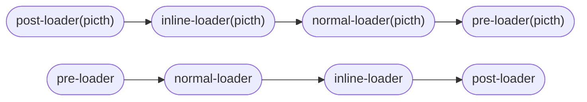

# loader

loader和plugins是webpack中最重要的一部分，其中loader是用来处理各种资源的，比如处理css样式，处理图片，处理字体文件等等。由于需要处理的资源很多，社区中为我们提供了很多常用的loader。此外，我们也可以自定义自己的loader，来实现自己对资源的处理。

## 常用loader

### 处理样式的loader

- less-loader
- sass-loader
- css-loader
- style-loader
- stylus-loader

## loader分类

loader可以分为:

- [同步loader](#同步loader)
- [异步loader](#异步loader)
- [raw loader](#raw-loader)
- [pitch loader](#pitch-loader)

### 同步loader

同步loader是在loader内同步执行逻辑代码的一种loader，在其内部不可以使用异步方法。基本的定义如下:

```js
// sync-loader.js
module.exports = function(content,map,meta) {
  return content;
}
```

在上面的示例中，我们直接返回了接收到的参数*content*，这是实现同步loader的一种方式。即把处理后的内容直接通过*return*返回。。但这种方式不能为下一个loader返回额外的内容，比如生成的*sourceMap*内容。在这个时候，我们就可以使用*this.callback*方法来实现同步loader了。如:
```js
// sync-loader.js
module.exports = function(content,map,meta) {
  this.callback(content,map,meta);
  return;
}
```

在使用这个方法的时候，我们就可以把处理后的内容和之前loader传递给我们的参数直接传递给之后的loader了。

介绍完了实现同步loader的两种方式，下面我们来介绍一个同步loader接收的三个参数：

- content
- map
- meta

> 注:不仅仅同步loader可以接收到这三个参数，异步laoder,raw loader,picth loader也会接收到这三个参数，在这里讲解后，后面的loader就不再讲解了。

*content*参数是loader接收到的资源文件的内容。*map*是对应的[SourceMap](https://github.com/mozilla/source-map)内容。*meta*是其它的额外任意数据。用于传递除*文件内容*和*SourceMap*之外的其它数据。

### 异步loader

顾名思义，异步loader就是可以在loader内部使用异步操作处理文件内容的loader。其基本形式如下:

```js
// async-loader.js
module.exports = function(content,map,meta) {
  const callback = this.async();
  someAsyncOperation(content, function(err, result) {
    if (err) return callback(err);
    return callback(content,map,meta);
  })
}
```

### raw loader

*raw loader*是一种特殊的loader，基本形式如下：

```js
// raw-loader.js
module.exports = fucntion(content, map, meta) {
  return content;
}

module.exports.raw = true;
```

我们注意到，*raw loader*和同步loader以及异步loader最大的不同在于其添加了一个`module.exports.raw = true`的语句。在添加了这个语句后，该loader接收的第一个参数`content`就不再是文件内容的字符串表示，而是文件内容的**原始Buffer**内容。这是*raw loader*和其它loader的显著区别。

### pitch loader

*raw loader*和其它loader的显著区别在于其接收到的第一个参数是资源的**原始Buffer**，而*picth loader*和其它loader的显著区别就在于其执行顺序上。在非*picth*的loader时，执行顺序是*从右到左*和*自下而上*，但在*picth*的loader中执行顺序是*从左到右*和*自上而下*的。更多请参见[loader执行顺序](#loader的执行顺序)。

*pictch loader*的基准形式如下:

```js
module.exports = function() {}
module.exports.pitch = function(remainRequest, precedingRequest, data) {
  data.value = 42;
}
```

除了执行顺序不同之外，*pitch loader*还有熔断机制。即当在某个*picth loader*中使用*return*返回后，之后的*picth loader*和loader都直接跳过，回头执行该loader之前的loader。

比如下面的场景:

有下面几个loader:loader1,loader2,loader3,loader4。其中,loader2中的*picth loader*使用了*return*返回语句并配置如下:

```js
module.exports = {
  // ...
  modules: {
    rules: [
      {
        test: /\.css$/,
        ues: ["loader1","loader2","loader3","loader4"]
      }
    ]
  }
}
```

其执行顺序如下:


在这其中，跳过了*loader3*和*loader4*的pitch loader和normal loader的执行，也跳过了*loader2*的normal loader的执行。

## loader的执行顺序

在配置loader的时候，我们可以配置一个叫`enforce`的字段，这个字段的值可以为*pre*和*post*。这个字段会影响到loader的执行顺序。

为了下面的讲解方便，我们约定如下:

`enforce`值为*pre*的字段称之为*pre-loader*，值为*post*的字段为*post-loader*，而没有定义`enforce`字段的值为*normal-loader*.

而`inline-loader`是一种特殊的*loader*，其应用在*import*或*require*的行内,如下所示:

```js
import myModule from 'raw-loader!my-module';
```

上面的示例中的*raw-loader*就是一个*inline-loader*;该loader应用于模块*my-module*。更多关于*inline-loader*的介绍请参考[inline-loader详情](#inline-loader)。

正常情况下的执行顺序是这样的：


对于picth loader的执行顺序则是这样的:


对于`enforce`值相同的loader，其执行顺序是 *从右到左*、*从下到上*。

完整的执行顺序:



### inline-loader

`inline-loader`是一种特殊的*loader*，其应用在*import*或*require*的行内,如下所示:

```js
import myModule from 'css-loader?modules!./style.css';
```

上面的示例中的*raw-loader*就是一个*inline-loader*;该loader应用于模块*my-module*。如果想要在一个*import*或*require*行内对模块应用多个*loader*，可以使用 *!* 分隔不同的loader:

```js
import myModule from 'style-loader!css-loader?modules!./stylee.css';
```

在上面的代码中，`my-module`应用了三个不同的行内loader，其执行顺序如下：


即其依然适用于*先下后上*，*先右后左*的执行顺序。

在*inline-loader*中，可以通过下面的几种方式来阻断一些*loader*的执行：

添加 *!* 阻断*normal-loader*的执行:

```js
import { a } from '!./file1.js'; // 阻断 normal-loader的执行
```

添加 *-!* 阻断*pre-loader*和*normal-loader*的执行:

```js
import { a } from '-!./file1.js'; // 阻断 normal-loader和pre-loader的执行
```

添加 *!!* 阻断 *pre-loader*,*normal-loader*和*post-loader*的执行:

```js
import { a } from '!!./file1.js'; // 阻断pre-loader,normal-loader和post-loader的执行
```
