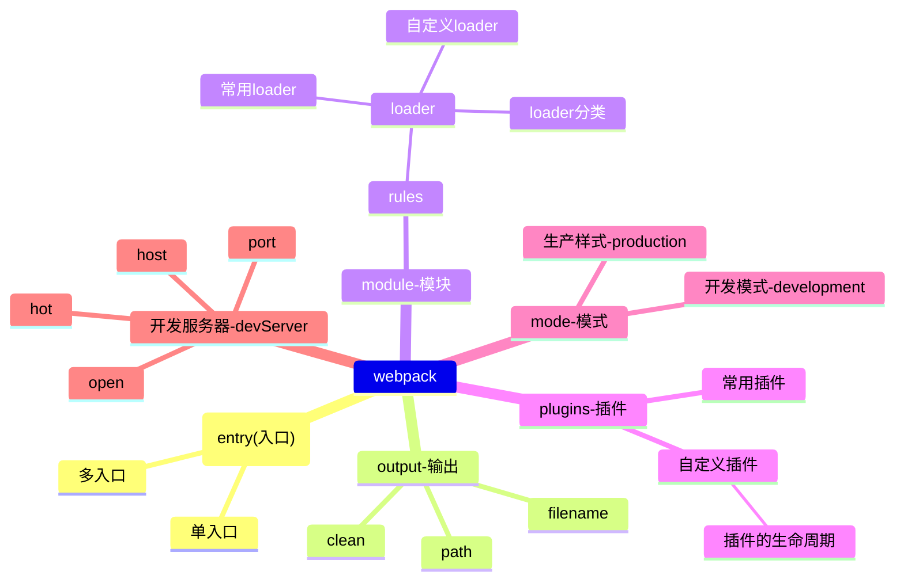

# Webpack

webpack是前端构建中优秀的打包工具。

## 配置

webpack配置中最主要的配置有下面几部分：

- entry [入口配置](./entry.md)
- output[输出配置](./output.md)
- module(模块配置)
- plugins(插件配置)
- mode(模式配置)

## 脑图



## 配置示例

开发配置

```js
  
```

生产配置

```js
  
```
