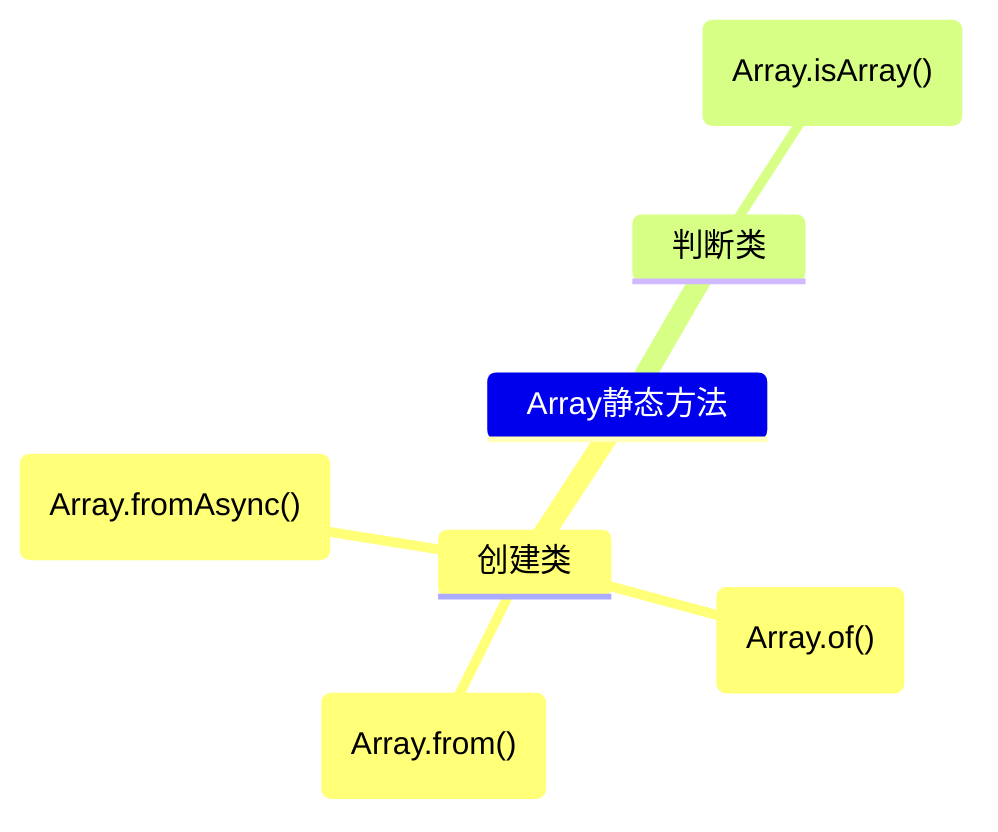
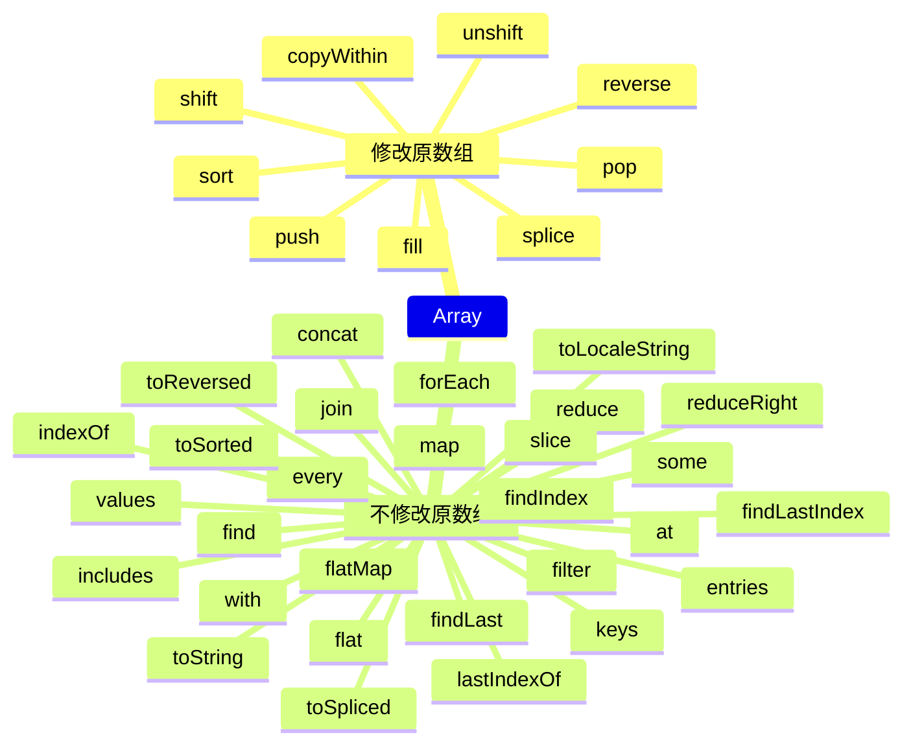
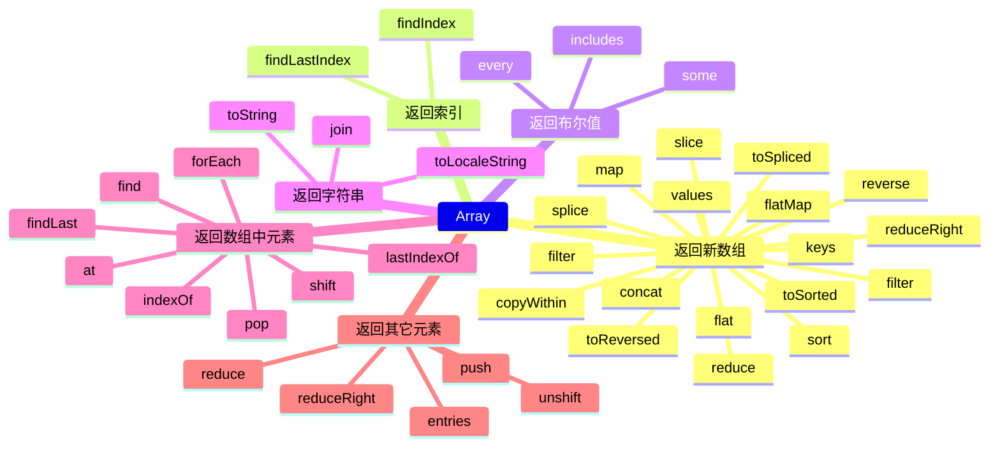
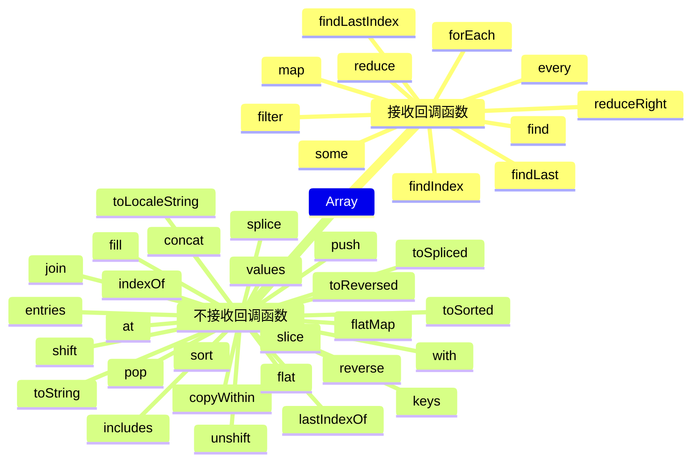
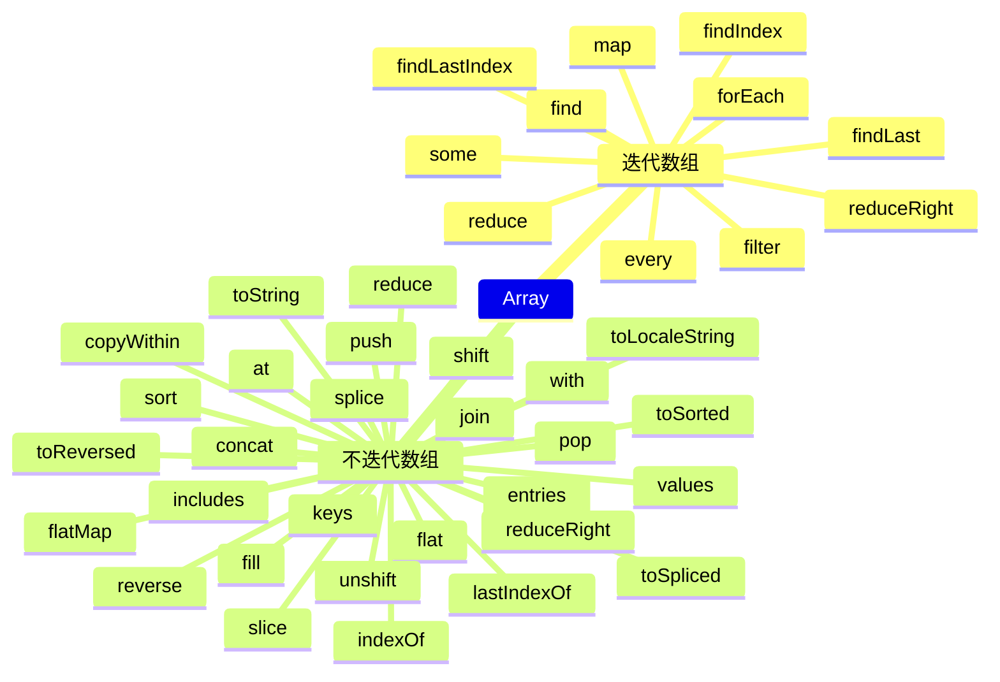

# 数组

JavaScript中的数组和其它语言中的数组有很大的不同。JavaScript中的数组中可以包含不同类型的元素并且是可以改变大小的。这就是很像是Java语言中动态数组和元组的结合体。

JavaScript中的数组以以下的方式定义:

```js
const array = [1,'2',true];
```

在简单介绍了JavaScript中的数组后，我们开始介绍JavaScript数组中的一些方法.

在介绍具体的方法前，我们先对这些方法进行一下分类：

首先，JavaScript中数组的方法可以分为静态方法和实例方法，其中，数组的静态方法比较简单，截止目前(2024-10)一共有4个静态方法和38个实例方法。这4个静态方法分别如下:

- [Array.from()](#from)
- [Array.of()](#of)
- [Array.fromAsync()](#fromasync)
- [Array.isArray()](#isarray)

由于实例方法过多，这个就不一一列出了，我们将在下面的[章节](#实例方法)中展开讲解。

## 静态方法

Array的静态方法可以也作用分为2类：

- 创建类方法
  - [Array.from()](#from)
  - [Array.of()](#of)
  - [Array.fromAsync()](#fromasync)
- 判断类方法
  - [Array.isArray()](#isarray)

以图表的形式表示如下:



### from

*Array.from*方法用于把一个可迭代对象或类数组对像转换为一个数组。比如`Set`,`字符串`,`Map`等。

我们通常使用的*Array.form()*是以下的形式：

```js
Array.from(arrayLike)
```

但*from*方法可不只有这一种形式，其还支持两个其他的可选参数:

- mapFn
- thisArg

从参数的命令上我们可以看到其可选的第二个参数是一个映射函数，其返回值会作为最终数组中的一元。而第三个参数则是一个this，用于替换*mapFn*中默认的this值。

下面是常用的几种方法示例：

```js
Array.from("hello"); // ["h","e","l","l","o"]

const set = new Set("JS","TS","Rust");
Array.from(set); // ["JS","TS","Rust"]

const map = new Map([
  [1, "JS"],
  [2, "TS"],
  [3, "Rust"]
]);
Array.from(map); // [ [1, "JS"], [2, "TS"], [3, "Rust"] ]

const mapper = new Map([
  [1, "JS"],
  [2, "TS"],
  [3, "Rust"]
]);
Array.from(mapper.values()); // ["JS","TS","Rust"]
Array.from(mapper,function(element,index) { return element[1] }); // ["JS","TS","Rust"]
Array.from(mapper, element => element[1]);

function f() {
  return Array.from(arguments);
}
f(1,2,3) // [1,2,3]

const images = document.querySelectorAll("img");
const sources = Array.from(images, image => image.src);
const insecureSources = sources.filter(link => link.startsWith("http://"));

// Array.from({length:5})方法会生成一个长度为5，元素全部为undefined的数组
Array.from({length: 5}, (v,i) => i); // [1,2,3,4,5]

const range = (start,stop,step) => {
  return Array.from({length: (stop - start) / step + 1}, (_,i) => start + i * step);
}

range(0,4,1); // [0,1,2,3,4]
range(1,10,2); // [1,3,5,7,9]

range("A".charCodeAt(0),"Z".charCodeAt(0),1).map(x=> String.fromCharCode(x)); // [""]
```


### of

*Array.of*方法通过可变数量的参数来创建对应数量元素的元素，并不考虑参数的数量或类型。比如：

```js
Array.of(7); // [7]
Array.of(); // []
Array.of(1,2,3,4); // [1,2,3,4]
Array.of(undefined); // [undefined]
```

在绝大部分情况下，`Array.of`方法和`Array`方法其创建出相同的数组。但在其只接收一个参数，且为下面情况之一时有所不同：

- 参数是一个整数
- 参数是一个浮点数

当参数是一个整数时，`Array.of`依然会创建以这个整数为单元素的一个数组。但`Array`则会创建一个以参数为个数，以**空属性**为元素的一个数组。

当参数是一个浮点数时，`Array.of`依然会创建以这个浮点数为单元步的一个数组。但`Array`则会报错:`Uncaught RangeError: Invalid array length`

### fromAsync

*Array.fromAsync*和*Array.from*类似，但*Array.fromAsync*可以由一个异步可迭代对象，可迭代对象或类数组对象创建一个新的、浅拷贝的Array实例。其语法和*Array.from*是一样的。即:

```js
Array.fromAsync(arrayLike);
Array.fromAsync(arrayLike,mapFn);
Array.fromAsync(arrayLike,mapFn,thisArg);
```

在这里，`mapFn`和`thisArg`的作用和*Array*中的作用是一样的。这里就不作介绍了。如果想要具体了解，请查看[Array.from](#from);

*Array.fromAsync*可以处理以下对象:

- 异步可迭代对象(如*ReadableStream*和*AsyncGenerator*)
- 可迭代对象
- 类数组对象(带有*length*属性和索引元素的对象)

*Array.fromAsync*和*Array.from*有以下的不同：

- *Array.fromAsync*可以处理异步可迭代对象
- *Array.fromAsync*返回一个会兑现为数组实例的[Promise](./promise.md)
- 如何使用非异步可迭代对象调用*Array.fromAsync*，则要添加到数组中的每个元素(无论是否为Promise)都会先等待其兑现。
- 如果提供了*mapFn*,则则其输入和输出会在内部等行兑现。

我们先来看看示例：

```js
const asyncIterable = (async function* () {
  for (let i = 0; i < 5; i++) {
    await new Promise((resolve)=> setTimeout(resolve,10 * i));
    yield i;
  }
})();
Array.fromAsync(asyncIterable).then(array => console.log(array)); // [0, 1, 2, 3, 4]

Array.fromAsync(new Set(1,2,3)).then(array => console.log(array)); // [1,2,3]

Array.fromAsync(new Set([Promise.resolve(1), Promise.resolve(2), Promise.resolve(3)])).then(array => console.log(array));
```

我们需要知道的是*Array.fromAsync*和*Promise.all*都可以将一个promise可迭代对象转换为一个数组的promise。但它们有两个关键区别:

- *Array.fromAsync*会依次等待对象中产生的每个值兑现。*Promise.all*会并行等待所有值兑现。
- *Array.fromAsync*惰性迭代可迭代对象，并且不会获取下一个值，直到当前值被兑现。*Promise.all*预先获取所有值并等待它们全部兑现。

### isArray

*Array.isArray*方法用于判断一个变量是否是数组。

> 注：Array.isArray方法不检查值的原型链。

示例：

```js
// 以下结果都为true
Array.isArray([]);
Array.isArray([1]);
Array.isArray(new Array());
Array.isArray(new Array("a","b","c"));
Array.isArray(new Array(3));
Array.isArray(Array.prototype);

// 以下结果都为false
Array.isArray();
Array.isArray({});
Array.isArray(null);
Array.isArray(undefined);
Array.isArray(17);
Array.isArray("Array");
Array.isArray(true);
Array.isArray(false);
Array.isArray(new Unit8Array(32));
```

## 实例方法

JavaScript 的 `Array` 实例方法可以根据它们的功能进行多种分类。以下是一些合法的分类方式：

### 1. 根据是否修改原数组分类：
- **修改原数组的方法**：
  - `copyWithin()`
  - `fill()`
  - `pop()`
  - `push()`
  - `reverse()`
  - `shift()`
  - `sort()`
  - `splice()`
  - `unshift()`

- **不修改原数组的方法**（返回新数组或值，原数组不变）：
  - `at()`
  - `concat()`
  - `entries()`
  - `every()`
  - `filter()`
  - `find()`
  - `findIndex()`
  - `findLast()`
  - `findLastIndex()`
  - `flat()`
  - `flatMap()`
  - `forEach()`
  - `includes()`
  - `indexOf()`
  - `join()`
  - `keys()`
  - `lastIndexOf()`
  - `map()`
  - `reduce()`
  - `reduceRight()`
  - `slice()`
  - `some()`
  - `toLocaleString()`
  - `toReversed()`
  - `toSorted()`
  - `toSpliced()`
  - `toString()`
  - `values()`
  - `with()`



### 2. 根据是否返回新数组分类：
- **返回新数组的方法**：
  - `concat()`
  - `filter()`
  - `flat()`
  - `flatMap()`
  - `keys()`
  - `map()`
  - `reduce()`
  - `reduceRight()`
  - `slice()`
  - `toReversed()`
  - `toSorted()`
  - `toSpliced()`
  - `values()`
  - `filter()`
  - `copyWithin()`
  - `sort()`
  - `reverse()`
  - `splice()`
- **返回索引**
  - `findIndex()`
  - `findLastIndex()`
- **返回布尔值**
  - `every()`
  - `some()`
  - `includes()`
- **返回字符串**
  - `toLocaleString()`
  - `toString()`
  - `join()`
- **返回数组中元素**
  - `at()`
  - `find()`
  - `findLast()`
  - `forEach()`
  - `lastIndexOf()`
  - `pop()`
  - `indexOf()`
  - `shift()`
- **返回其它元素**
  - `reduce()`
  - `reduceRight()`
  - `push()`
  - `unshift()`
  - `entries()`

  



### 3. 根据是否接受回调函数分类：
- **接受回调函数的方法**：
  - `every()`
  - `filter()`
  - `find()`
  - `findIndex()`
  - `findLast()`
  - `findLastIndex()`
  - `forEach()`
  - `map()`
  - `reduce()`
  - `reduceRight()`
  - `some()`

- **不接受回调函数的方法**：
  - `at()`
  - `concat()`
  - `copyWithin()`
  - `entries()`
  - `fill()`
  - `flat()`
  - `flatMap()`
  - `includes()`
  - `indexOf()`
  - `join()`
  - `keys()`
  - `lastIndexOf()`
  - `pop()`
  - `push()`
  - `reverse()`
  - `shift()`
  - `slice()`
  - `sort()`
  - `splice()`
  - `toLocaleString()`
  - `toReversed()`
  - `toSorted()`
  - `toSpliced()`
  - `toString()`
  - `unshift()`
  - `values()`
  - `with()`



### 4. 根据迭代方式分类：
- **迭代数组元素的方法**：
  - `every()`
  - `filter()`
  - `find()`
  - `findIndex()`
  - `findLast()`
  - `findLastIndex()`
  - `forEach()`
  - `map()`
  - `reduce()`
  - `reduceRight()`
  - `some()`

- **不迭代数组元素的方法**：
  - `at()`
  - `concat()`
  - `copyWithin()`
  - `entries()`
  - `fill()`
  - `flat()`
  - `flatMap()`
  - `includes()`
  - `indexOf()`
  - `join()`
  - `keys()`
  - `lastIndexOf()`
  - `pop()`
  - `push()`
  - `reduce()`
  - `reduceRight()`
  - `reverse()`
  - `shift()`
  - `slice()`
  - `sort()`
  - `splice()`
  - `toLocaleString()`
  - `toReversed()`
  - `toSorted()`
  - `toSpliced()`
  - `toString()`
  - `unshift()`
  - `values()`
  - `with()`



这些分类方式可以帮助开发者更好地理解和使用数组方法，根据不同的需求选择合适的方法来处理数组数据。

### concat

*concat*方法用于在已有数组的基础之上创建一个新的数组。其基本的语法如下:

```js
concat()
concat(value0)
concat(value0, value1)
concat(value0, value1, /*...,*/ valueN)
```

*concat*方法接收0到多个参数。其参数如何不是一个数组，那么该参数会被直接添加到新的数组中。如果参数是一个数组，那么*concat*会把这个参数先打平，再把结果添加到数组中。或者可以说，*concat*会把数组中的元素依次添加到新的数组中。*concat*不会修改原数组，而是直接返回一个新的数组。

示例如下：

```js
[1,2,3].concat(['a','b','c']); // [1,2,3,'a','b','c']
[1,2,3].concat('a','b','c'); // [1,2,3,'a','b','c']
```

*concat*方法的重点是:

- 不会修改原数组，返回新数组
- 合并多个数组到新数组中
- 合并多个元素到新元素中

### at

*at*方法用于接收一个整数并把这个整数作为索引，返回该索引处的元素。允许正数和负数。负整数从数组中的最后一个元素开始倒数。

示例代码：

```js
const array = [1,2,3];
array.at(0); // 1
array.at(-1); // 3 获取数组中的最后一个元素
```

我们注意到，*at*方法和直接使用索引获取数组中的值的方法很类似。只是我们不能直接使用负数作为索引获取数组中的元素。但可以在*at*中使用负数来访问数组中的元素。即我们可以通过*at(-1)*的形式直接获取数组中的最后一个元素。

重点：

- *at*是一个访问形方法，不会修改原数组
- 可以使用索引访问到的元素，也可以使用*at*方法访问
- *at*中可以使用负数访问数组元素

### copyWithin

*copyWithin*方法用于在数组内部复制元素。其会把数组中某部分的元素复制到指定的位置。其基本形式如下:

```js
copyWithin(target)
copyWithin(target, start)
copyWithin(target, start, stop)
```

通过签名，我们知道，*copyWithin*方法会把从*start*到*stop*之前的元素复制到以*target*为开始索引的位置。

需要注意的是，*target*,*start*和*stop*都可以使用负数。如果使用的是负数，其取值分为以下情况(*target*,*start*和*stop*统一为*x*):

- -array.length < x < 0 , x取值为*x+array.length*
- x < -array.length, x取值为*0*

或者说取值为下面的公式: `max(0,x+array.length)`

并且在下面的几种情况下，*copyWithin*方法不会复制任何内容:

- *target* > *array.length*
- *start* > *array.length*
- *end* > *start*

同时，*start*和*stop*有以下的默认值:

- start: 0
- end: array.length


示例：
```js
const array = [1,2,3];
array.copyWithin(2); // [1,2,1]; array也是[1,2,1]
const array1= [1,2,3];
array1.copyWithin(1,2); // [1,3,3]; array1也是[1,3,3]
const array2 = [1,2,3];
array2.copyWithin(1,2,1); // [1,2,3]; array2也是[1,2,3]
```

重点:

- *copyWithin*方法返回修改后的数组
- *copyWithin*方法会修改原数组

### entries

*entries*方法返回一个数组迭代器对象，该对象包含数组中每个索引的键/值对。

示例：

```js
const array = ["a","b","c"];
array.entries().forEach(v=>console.log(v)); // [0,'a'] [1,'b'] [2,'c']
```

重点:

- 返回值是一个可迭代对象


### every

*every*方法通过一个断言函数来查看是否数组内的内容都符合某个条件。其返回值为一个布尔值。只要数组中有一个元素不能通过断言函数，则返回结果就为*false*。

示例如下:

```js
const array = [1,2,3,4];
array.every(x=>x<5); // true;
array.every(x=>x%2===0); // false
```

因为只要数组中有一个元素不符合断言函数，最终结果就为*false*。所以*every*方法并不一定要遍历完数组中的所有元素。在遍历过程中，只要有一个元素不符合断言函数，那么*every*方法就会中断遍历并立即返回*false*.

重点:

- 空数组的*every*方法永远返回*true*
- *every*不遍历*稀疏数组*中的空元素。
- *every*方法遇到返回*false*的元素后立即返回*false*

> ⚠️ 全部由空元素组成的数组的*every*方法也永远返回*true*.

### fill

TODO
