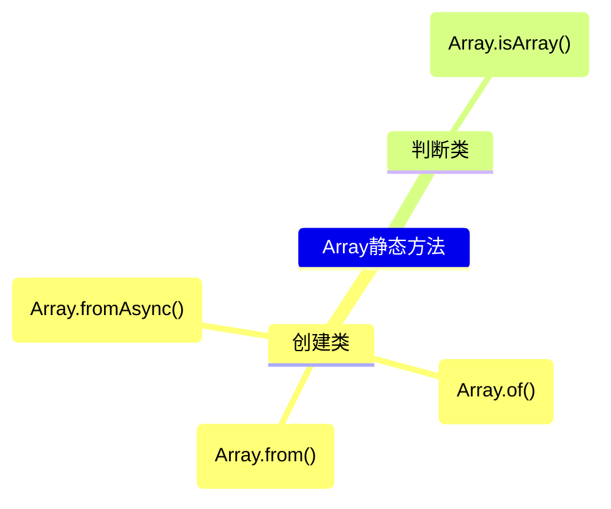

# 数组

JavaScript中的数组和其它语言中的数组有很大的不同。JavaScript中的数组中可以包含不同类型的元素并且是可以改变大小的。这就是很像是Java语言中动态数组和元组的结合体。

JavaScript中的数组以以下的方式定义:

```js
const array = [1,'2',true];
```

在简单介绍了JavaScript中的数组后，我们开始介绍JavaScript数组中的一些方法.

在介绍具体的方法前，我们先对这些方法进行一下分类：

首先，JavaScript中数组的方法可以分为静态方法和实例方法，其中，数组的静态方法比较简单，截止目前(2024-10)一共有4个静态方法和38个实例方法。这4个静态方法分别如下:

- Array.from()
- Array.of()
- Array.fromAsync()
- Array.isArray()

由于实例方法过多，这个就不一一列出了，我们将在下面的[章节](#实例方法)中展开讲解。

## 静态方法

Array的静态方法可以也作用分为2类：

- 创建类方法
  - [Array.from()](#from)
  - Array.of()
  - Array.fromAsync()
- 判断类方法
  - Array.isArray()

以图表的形式表示如下:



### from

*Array.from*方法用于把一个可迭代对象或类数组对像转换为一个数组。比如`Set`,`字符串`,`Map`等。

我们通常使用的*Array.form()*是以下的形式：

```js
Array.from(arrayLike)
```

但*from*方法可不只有这一种形式，其还支持两个其他的可选参数:

- mapFn
- thisArg

从参数的命令上我们可以看到其可选的第二个参数是一个映射函数，其返回值会作为最终数组中的一元。而第三个参数则是一个this，用于替换*mapFn*中默认的this值。

下面是常用的几种方法示例：

```js
Array.from("hello"); // ["h","e","l","l","o"]

const set = new Set("JS","TS","Rust");
Array.from(set); // ["JS","TS","Rust"]

const map = new Map([
  [1, "JS"],
  [2, "TS"],
  [3, "Rust"]
]);
Array.from(map); // [ [1, "JS"], [2, "TS"], [3, "Rust"] ]

const mapper = new Map([
  [1, "JS"],
  [2, "TS"],
  [3, "Rust"]
]);
Array.from(mapper.values()); // ["JS","TS","Rust"]
Array.from(mapper,function(element,index) { return element[1] }); // ["JS","TS","Rust"]
Array.from(mapper, element => element[1]);
```


### of

### fromAsync

### isArray

## 实例方法

JavaScript 的 `Array` 实例方法可以根据它们的功能进行多种分类。以下是一些合法的分类方式：

### 1. 根据是否修改原数组分类：
- **修改原数组的方法**：
  - `copyWithin()`
  - `fill()`
  - `pop()`
  - `push()`
  - `reverse()`
  - `shift()`
  - `sort()`
  - `splice()`
  - `unshift()`

- **不修改原数组的方法**（返回新数组或值，原数组不变）：
  - `at()`
  - `concat()`
  - `entries()`
  - `every()`
  - `filter()`
  - `find()`
  - `findIndex()`
  - `findLast()`
  - `findLastIndex()`
  - `flat()`
  - `flatMap()`
  - `forEach()`
  - `includes()`
  - `indexOf()`
  - `join()`
  - `keys()`
  - `lastIndexOf()`
  - `map()`
  - `reduce()`
  - `reduceRight()`
  - `slice()`
  - `some()`
  - `toLocaleString()`
  - `toReversed()`
  - `toSorted()`
  - `toSpliced()`
  - `toString()`
  - `values()`
  - `with()`

### 2. 根据是否返回新数组分类：
- **返回新数组的方法**：
  - `concat()`
  - `entries()`
  - `filter()`
  - `flat()`
  - `flatMap()`
  - `keys()`
  - `map()`
  - `reduce()`
  - `reduceRight()`
  - `slice()`
  - `toReversed()`
  - `toSorted()`
  - `toSpliced()`
  - `values()`

- **不返回数组，返回其他值或`undefined`**：
  - `at()`
  - `copyWithin()`
  - `entries()`
  - `every()`
  - `fill()`
  - `filter()`
  - `find()`
  - `findIndex()`
  - `findLast()`
  - `findLastIndex()`
  - `forEach()`
  - `includes()`
  - `indexOf()`
  - `join()`
  - `lastIndexOf()`
  - `pop()`
  - `push()`
  - `reduce()`
  - `reduceRight()`
  - `reverse()`
  - `shift()`
  - `slice()`
  - `some()`
  - `sort()`
  - `splice()`
  - `toLocaleString()`
  - `toString()`
  - `unshift()`
  - `with()`

### 3. 根据是否接受回调函数分类：
- **接受回调函数的方法**：
  - `every()`
  - `filter()`
  - `find()`
  - `findIndex()`
  - `findLast()`
  - `findLastIndex()`
  - `forEach()`
  - `map()`
  - `reduce()`
  - `reduceRight()`
  - `some()`

- **不接受回调函数的方法**：
  - `at()`
  - `concat()`
  - `copyWithin()`
  - `entries()`
  - `fill()`
  - `flat()`
  - `flatMap()`
  - `includes()`
  - `indexOf()`
  - `join()`
  - `keys()`
  - `lastIndexOf()`
  - `pop()`
  - `push()`
  - `reverse()`
  - `shift()`
  - `slice()`
  - `sort()`
  - `splice()`
  - `toLocaleString()`
  - `toReversed()`
  - `toSorted()`
  - `toSpliced()`
  - `toString()`
  - `unshift()`
  - `values()`
  - `with()`

### 4. 根据迭代方式分类：
- **迭代数组元素的方法**：
  - `every()`
  - `filter()`
  - `find()`
  - `findIndex()`
  - `findLast()`
  - `findLastIndex()`
  - `forEach()`
  - `map()`
  - `reduce()`
  - `reduceRight()`
  - `some()`

- **不迭代数组元素的方法**：
  - `at()`
  - `concat()`
  - `copyWithin()`
  - `entries()`
  - `fill()`
  - `flat()`
  - `flatMap()`
  - `includes()`
  - `indexOf()`
  - `join()`
  - `keys()`
  - `lastIndexOf()`
  - `pop()`
  - `push()`
  - `reduce()`
  - `reduceRight()`
  - `reverse()`
  - `shift()`
  - `slice()`
  - `sort()`
  - `splice()`
  - `toLocaleString()`
  - `toReversed()`
  - `toSorted()`
  - `toSpliced()`
  - `toString()`
  - `unshift()`
  - `values()`
  - `with()`

这些分类方式可以帮助开发者更好地理解和使用数组方法，根据不同的需求选择合适的方法来处理数组数据。


