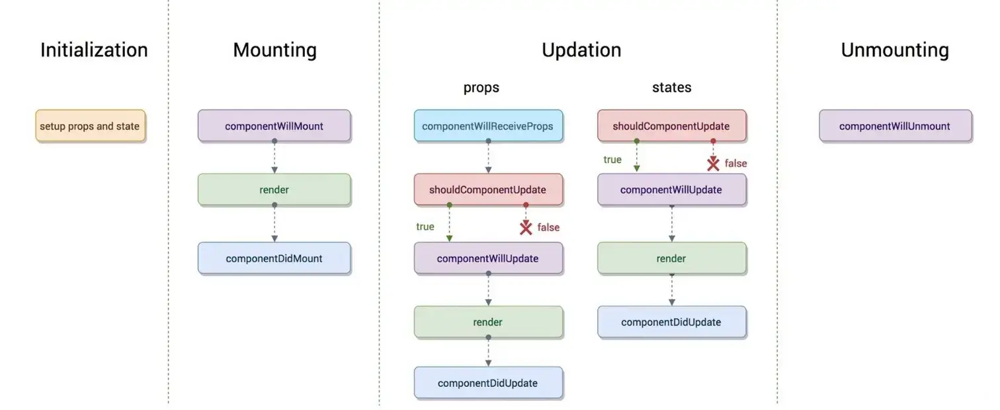
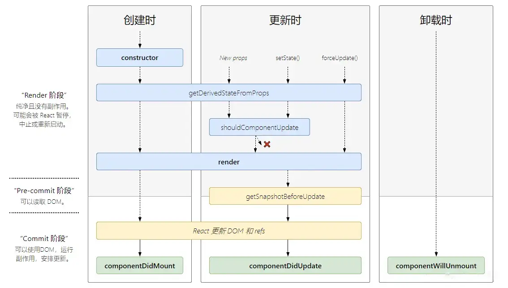

# 生命周期

React组件的生命周期指的是组件从创建到销毁的整修过程，这个过程包括了几个关键的阶段:创建、更新和销毁。在不同的阶段，React提供了不同的生命周期方法，允许开发者在这些特定的时刻执行代码。

对于类组件，React17版本之前定义了以下生命周期方法:

1. **挂载阶段**
  - __contructor()__: 构建函数，用于初始化组件实例，如绑定方法和初始化状态。
  - __render()__: 渲染方法，返回要渲染的元素，这个方法是纯的，不应该执行与渲染无关的操作。如数据获取或副作用。
  - __componentDidMount()__: 组件挂载后(即添加到DOM树中)被调用。通常用于执行DOM操作、数据获取或其他需要在客户端完成的操作。
2. **更新阶段**
  - __render()__: 当组件的状态或属性改变时，render方法会被调用。
  - __shouldComponentUpdate()__: 在组件接收到新的属性或状态时被调用，返回一个布尔值，用于决定是可继续执行render方法。这是优化性能的地方。
  - __componentWillReceiveProps()__: 在组件即将接收到属性之前被调用。(已在React16.3中被弃用)
  - __componentWillUpdate()__: 在render方法执行之前被调用，最后一次渲染之前。
  - __componentDidUpdate()__: 在组件更新后被调用，可以在这里执行DOM操作或网络请求。
3. **卸载阶段**
  - __componentWillUnmount()__: 在组件卸载和销毁之前被调用，用于执行清理操作，如取消计时器、取消网络请求、清理在componentDidMount中设置的订阅等。

React16.3引入了新的生命周期方法，以替换旧的不安全的生命周期方法:
  - __static getDerivedStateFromProps()__: 在渲染之前和接收新属性时被调用，用于根据属性变化来更新状态。
  - __getSnapshotBeforeUpdate()__: 在更新之前(在render之后)被调用，允许在更新发生之前进行最后的修改，如捕获滚动位置或焦点状态等。

React17版本中，以下旧的生命周期方法被标记为废弃，并被新的生命周期方法所取代:
  - __componentWillMount()__: 在挂载之前被调用，已被*contructor()*和*static getDerivedStateFromProps()*所取代
  - __componentWillReceiveProps()__: 在接收到新的属性之前被调用，已被*static getDerivedStateFromProps()*所取代
  - __componentWillUpdate__: 在更新之前被调用，已被*getSnapshotBeforeUpdate()*所取代

**旧生命周期**:

**新生命周期**:

