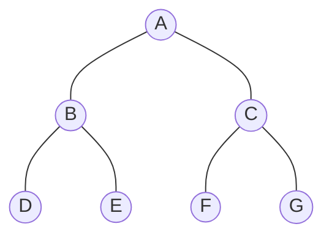

{{#title Rust算法-树}}
# 树

在数据结构与算法中，树是最常用的非线性结构。下面是树的一个示例:

通过上图，我们总结一下树定义：

>  1. 树具有一个根节点
>  2. 除根节点外，每个节点通过其他节点的边互相连接父和子节点(若有)。
>  3. 从根遍历到任何节点的路径全局唯一。

下面，我们再来统一一下树的各种属性:

- **节点**: 节点是树的基本部分。节点可以有附加信息，附加信息称为*有效载荷*。虽然有效载荷不是许多树算法的核心，但在利用树的应用中通常是关键的，比如树节点上存储时间、文件名等。
- **根**: 根是树中唯一没有传入边的节点，它处于顶层，所有的节点都可以从根找到。
- **边**: 边是树的另一个基本部分，又叫分支。边连接再个节点以保持之间存在的关系。每位节点，除根之外，都恰好有一个输入边和若干个输出边。
- **路径**: 路径是由边连接节点的有序序列，是由其逻辑结构涌现出来的一种信息。
- **子节点**: 子节点是某个节点的下一级，所有子节点都源自同一个上层节点。
- **父节点**: 父节点是所有下级节点的源，所有子节点都源自同一个父节点。
- **子树**: 子树是由父节点和该父节点的所有后代组成的一组节点和边。因为树这种递归结构，从树中任意节点取出一部分，它的结构都依然是树，这部分取出的内容就是子树。
- **叶节点**: 叶节点是没有子节点的节点，处于最底层。
- **中间节点**: 中间节点有子节点，有父节点。
- **层数**: 节点n的层数是从根到该节点所经过的分支数目(边数)。
- **高度**: 树的高度等于从树的根节点到叶子节点的最长路径的最大层数。    

