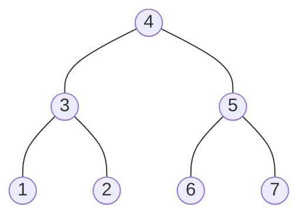

{{#title Rust算法-二叉搜索树}}

# 二叉搜索树

我们知道在一个有序的数组中可以通过二分查找的算法实现**O(logn)**的复杂度查找。但是，如果在一个有序的数组中去进行插入和删除操作，时间复杂度就会变为**O(n)**。在这种情况下，为了能够也使得插入和删除的时间复杂度也是**O(logn)**，于是，二叉搜索树就诞生了。

## 二叉搜索树的性质

二叉搜索树具有以下的性质:

- 是一个二叉村
- 其子节点和父节点的键符合以下要求: **left < parent < right**.
- 中序遍历的结果就是从小到大的顺序
- 镜像中序遍历[^1]的结果就是从大到小的顺序

如下就是一个二叉搜索树:



[^1]:即遍历顺序为*根右左*

## 二叉搜索树的基本表示

为了在二叉搜索树中保存一些额外的信息，在实现二叉搜索树的时候，除了必要的*key*,*left*和*right*字段之外，还添加了*val*字段来保存*key*对应的一些额外的信息。

下面来看看在Rust中的二叉搜索树的基本表示:

```rust,no_run,noplayground
{{#include ../../src/binary_search_tree.rs:1:14}}
```

在基本结构中，各位字段的含义如下:

- `key` 在二叉搜索树中的键，其是查找、插入的关键，对于于HashMap中的键
- `val` 存储在二叉搜索树中的值，其对应于HashMap中的值
- `left` 二叉搜索树的左子树的引用
- `right` 二叉搜索树的右子树的引用

## 二叉搜索树的基本操作

在定义完二叉搜索树的基本表示后，我们就需要为二叉搜索树定义一些基本的操作了，这些基本操作包括以下内容:

- `new` 构建一个新的二叉搜索树
- `insert` 在二叉搜索树中添加新的键值
- `search` 在二叉搜索树中查询是否拥有某个指定的键
- `get` 在二叉搜索树中查找指定的键中对应的值

```rust,no_run,noplayground
{{#include ../../src/binary_search_tree.rs:16:161}}
```

## 二叉搜索树的遍历方法

在定义元二叉搜索树的基本操作后，让我们来为二叉搜索树实现一下前中后的遍历方法：

```rust,no_run,noplayground
{{#include ../../src/binary_search_tree.rs:162:210}}
```

## 二叉搜索树的最大值和最小值

利用二叉搜索树的**left < parent < right**的性质，我们可以很容易的找到二叉搜索树中的最大值和最小值，现在就让你们来实现它:

```rust,no_run,noplayground
{{#include ../../src/binary_search_tree.rs:211:}}
```

# 总结

在这里我们实现了Rust中二叉搜索树的基本表示和相关操作，使用二叉搜索树在平均情况下，可以实现时间复杂度为 **O(logn)** 的查找，插入和删除操作。但是，如果我们在向二叉搜索树中插入元素的时候，元素是有序的，那么，二叉搜索树就会退化成链表。这个时候的时间复杂度会退化成**O(n)**,为了进一步提升性能，就有了平衡二叉树。
