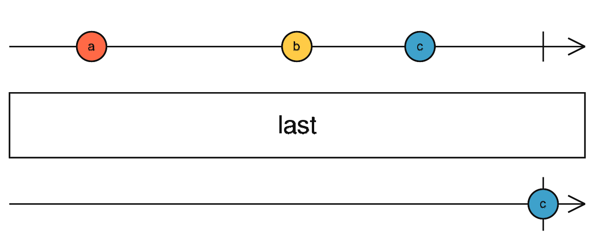
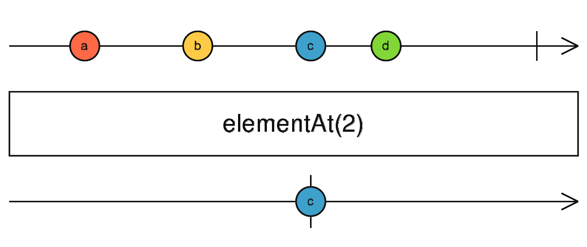
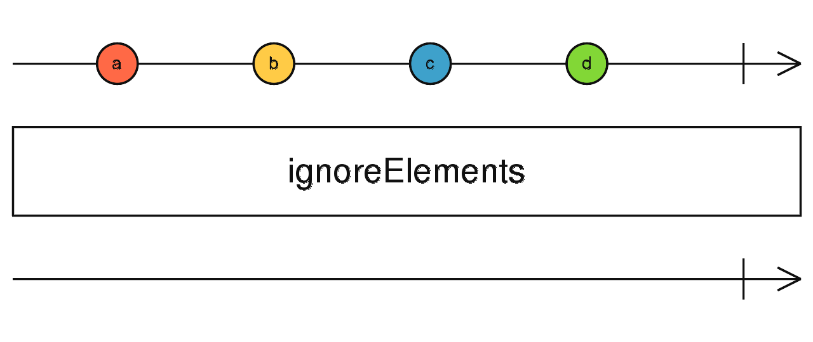

{{#title RxJS简易过滤操作符}}

# RxJS简易过滤操作符

在RxJS的过滤操作符中，有一类很简单的操作符，其分别是下面的几个:

- first
- last
- ignoreElements
- elementAt

## first操作符

### 简介

`first`操作符用于从源Observable中获取并发出第一个值，然后自动完成(complete)订阅。也就是说，它只会关注源Observable发出的第一个值，一旦获取到这个值，就会将其传递给下游的Observer,并且结束整个订阅过程。

### 背景

在很多实际应用场景中，我们可能只对一个数据流中的第一个值感兴趣。例如，当一个应用程序启动时，可能会有一系列的初始化事件或数据发出，而我们只需要获取最初的那个启动状态相关的值来进行后续的特定处理，比如显示一个初始的欢迎界面等。`first`操作符就可以很方便地帮助我们提取出这个我们关心的第一个值，避免处理整个数据流中可能大量后续的值，简化了数据处理流程。

### 示例

```js
import { of, first } from "rxjs";

const source$ = of(1, 2, 3);
source$.pipe(first()).subscribe((value) => {
  console.log("经过first处理后的值:", value);
});
```

在上述示例中:

1. 首先通过`of`函数创建了一个发出值为`1`,`2`,`3`的Observable.
2. 然后使用`first`操作符对这个Observable进行处理。
3. 最后通过订阅处理后的Observable,在控制台打印出经过`first`处理后获取到的第一个值，即`1`.

### 应用场景

- **获取初始化数据**: 如前面提到的应用程序启动时，获取最初的启动状态相关数据，比如获取首次加载的配置文件中的某个关键参数值。
- **处理事件流中的首个事件**: 在一个包含多个事件的事件流,只关注第一个发生的事件并进行相应处理，例如在用户登录流程中，获取首次登录时触发的某个特定初始事件进行分析或记录。

## last操作符

### 简介

`last`操作符的作用是从源Observabe中获取并发出最后一个值，然后自动完成订阅。与`frist`操作符相反，它专门用于提取源Observable发出的最后一个值，一旦得到这个值，就会传递给下游的Observer并结束订阅。

### 背景

在一些场景下，我们更关心一个数据流的最终状态或最后一个值。比如在一个长时间运行的任务完成后，可能会有一系统的结果值陆续发出，而我们只想知道最终的那个结果，以便进行后续的总结、存储或展示等操作。`last`操作符就能满足这种需求，帮助我们精准地获取到最后一个值，而无需处理中间的其他值。

### 示例

```js
import { of, last } from "rxjs";

const source$ = of(1, 2, 3);
source$.pipe(last()).subscribe((value) => {
  console.log("经过last处理后的值:", value);
});
```

在上述示例中:

1. 首先通过`of`函数创建了一个发出值为`1`,`2`,`3`的Observable.
2. 然后通过`last`操作符对这个Observable进行处理.
3. 最后通过订阅处理后的Observable,在控制台打印出经过`last`获取后获取到的最后一个值，即`3`。

### 应用场景

- **获取任务最终结果**: 在长时间运行的任务(如数据处理任务、文件下载任务等)完成后，获取最后输出的结果值，以便进行后续的处理，比如将结果存储到数据库或展示给用户。
- **分析事件的最终状态**: 在一个包含多个事件的事件流中，关注最后一个发生的事件并进行相应处理，例如在用户退出流程中，获取最后触发的某个特定事件进行分析或记录。

## elementAt操作符

### 简介

`elementAt`操作符用于从源Observable中获取并发出指定登录位置的那个值，火自动完成订阅。它允许我们根据一个给定的索引值，从源Observable发出的一系列值中准确地提取出我们某要的那个值。

### 背景

有时候我们并不关心一个数据流中的第一个或最后一个值，而是对其中某个特定位置的价值感兴趣。比如在一个数组形式的数据流中，我们可能想获取第3个值进行单独的分析或处理。`elementAt`操作符就提供了这样一种机制，让我们能够按照自己的需求从数据流中选取特定位置的价值，而不必处理整个数据流。

### 示例

```js
import { of, elementAt } from "rxjs";

const source$ = of(1, 2, 3);
source$.pipe(element(1)).subscribe((value) => {
  console.log(`经过elementAt处理后的值:`, value);
});
```

在上述示例中:

1. 首先通过`of`函数创建了一个发出值为`1`,`2`,`3`的Observable。
2. 然后使用`elementAt`操作符对这个Observable进行处理，指定南山值为`1`(注意，南山从0开始)。
3. 最后使用订阅处理的的Observable，在控制台打印出经过`elementAt`处理后获取到的第2个值，即`2`。

### 应用场景

- **获取数组形式数据流中特定位置的值**: 当数据流呈现数组形式，且我们需要获取其中某个特定位置的价值进行分析、处理或展示时，比如在一个包含多个用户信息的数据流中，获取第5个用户的信息进行单独处理。
- **根据索引选择事件流中的事件**: 在一个包含多个事件的事件流中，根据给定的索引选择特定的事件进行分析或处理，例如在一系列用户操作事件中，选择第7个操作事件进行深入分析。

## ignoreElements操作符

### 简介

`ignoreElements`操作符会忽略源Observable发出的所有值，只关注Observable是否完成(complete)或抛出错误(error)。也就是说，当使用了这个操作符后，下游的Observer不会接收到任何来自源Observable的值。但会知道源Observable什么时候完成或者出现了错误。

### 背景

在一些场景下，我们可能并不需要处理一个数据流中的具体值，而是只关心这个数据流是否完成或者是否出现了错误情况。比如在启动一个后台任务时，我们可能只关心这个任务是否最终完成了，或者在执行过程中出现了错误，而不需要对任务执行过程中发出的每一个数据进行处理。`ignoreElements`操作符就可以满足这种需求，帮助我们简化对数据流的关注重点，只聚集于完成和错误状态。

### 示例

```js
import { of, ignoreElements } from "rxjs";

const source$ = of(1, 2, 3);
source$.pipe(ignoreElements()).subscribe({
  complete() {
    console.log("源Observable已完成");
  },
  error(err) {
    console.log("源Observable出现错误:", err);
  },
});
```

在上述示例中:

1. 首先通过`of`函数创建了一个发出值为`1`,`2`,`3`的Observable.
2. 然后使用`ignoreElements`操作符对这个Observable进行处理。
3. 最后通过订阅处理后的Observable,当源Observable完成时，会在控制台打印出'源Observable已完成';当源Observable出现错误时，会在控制台打印出'源Observable出现错误:',后面跟着具体的错误信息。

### 应用场景

- **监控任务完成状态**: 在启动后台任务(如数据处理、文件下载等)时，只关心任务是否完成以及是否出现错误，而不需要处理任务执行过程中发出的每一个数据。
- **检测数据源的稳定性**: 在连接到一个数据源(如数据库、网络服务等)时，只关心数据源是否能正常完成数据传输或者是否会出错错误，而不关心具体的数据内容。

## 弹珠图


<center><b>first弹珠图</b></center>

---



<center><b>last弹珠图</b></center>

---



<center><b>elementAt弹珠图</b></center>

---



<center><b>ignoreElements弹珠图</b></center>

---
