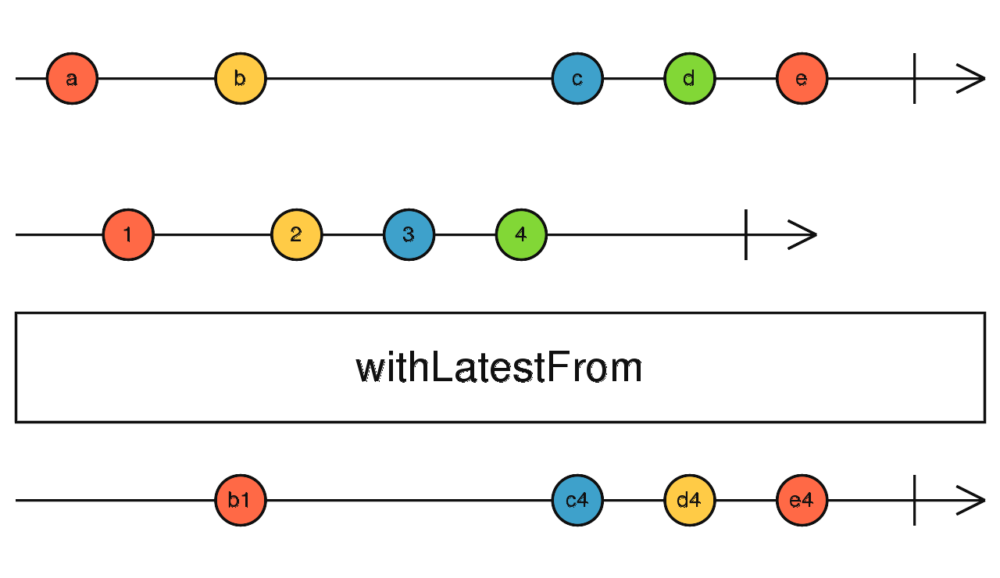

{{#title RxJS联结操作符-withLastestFrom}}
# withLastestFrom

将源Observable与其它Observable进行组合以创建一个Observable,其值是根据每个Obsevable的最新值计算的，仅当源发送时才发送。

> 每当**源Observable**发出一个值时，它会使用该值加上来自其它输入Observable的**最新值**计算一个公式，然后发送该公开的输出结果。



withLatestFrom只会在源发送一个值时将源Observable中的每个值与来自其它输入Observable的最新值组合在一起，使用可选的project函数来确定要在输出Observable上发送的值。在输出Observable发送一个值之前，所有输入Observable必须发送过至少一个值。

重点:

- **最新值**
- **每个Observable至少发送过一个值**
- **源Observable发送值时产生值**

## 示例

```javascript
import { fromEvent, interval, withLatestFrom } from "rxjs";

const click$ = fromEvent(docuement, 'click');
const timer = interval(1000);
const result = click$.pipe(withLatestFrom(timer));
result.subscribe(x=>console.log(x));
```

## 与combineLatest的区别

`withLatestFrom`与`combineLatest`有不少的相同点：

- 都是根据源发送的最新值和公式来决定输出内容
- 都是至少每个源都至少发送过一个值
- 结果都是以数组形式产生的

区别在于:

- `withLatestFrom`只有在源Observable发送新值时才产生值
- `combineLatest`只要有一个Observable发送一个新值，就会产生值

## 参见

- [combineLatest](./combinelatest.md "combineLatest操作符") 
